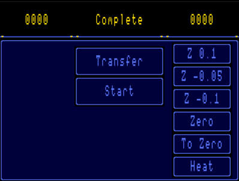
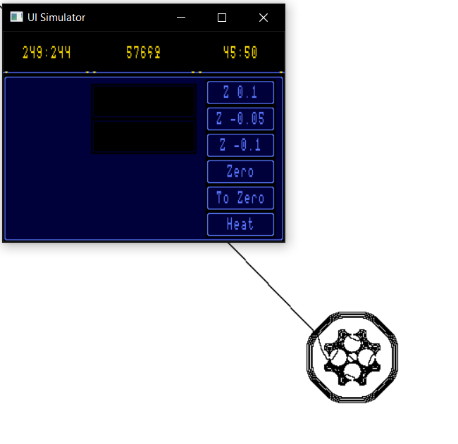

# 3D Printer Firmware
Homemade 3D Printer firmware based on STM chip with limited ability for customization

## Components
* 3D Printer Firmware. 
* STM32* HAL based high level library of microelectronics components that can be used separatly outside of the project.
* SW components library
* Tests and Mock components
* Set of supporting programs
   * PrinterEmulator  - Emulator of printer firmware
   * MaterialEditor   - Material data compiler, can be used to create built-in material overrides. (not used)
   * CommandsCompiler - Standalone compiler of G-Code commands to check correctness of compilation or create binary buffer that can be used by printer firmware. (not used)
   
## [3D Printer Firmware](lib/printer)
The simple 3d printer firmware implemented for STM32 processor.
### Construction:
The printer contains different components working together to provide stable and accurate printing. Printer operates without external connection to any PC/Laptop. All commands and models provided through SDCard. The configuration and interaction with user is done using ILI9341 display with touch. UI library supports different set of components that used in forming printer UI.  

Components:
* [STM32F401RE](https://www.st.com/resource/en/datasheet/stm32f401re.pdf) card
* [ILI9341](https://cdn-shop.adafruit.com/datasheets/ILI9341.pdf) display with touch 
* 2x [SDCARDs](https://elinux.org/images/d/d3/Mmc_spec.pdf), one can be replaced by flash module with SPI protocol support 
* 3x reley (better to use solid body)
   * Nozzle Heater Reley 
   * Table Heater Reley
   * Head Cooling Fan Reley or velocity control
* 4x TMC drivers for axis movement alongside X, Y, Z and Extruder
* Timer watchdog diode for motors controling thread
* Error indicator diode to notify about fatal errors of the system

Dual SDCard configuration: 
* External storage. user can upload GCode models into internal storage using for furter printing
* Internal storage. currently used as an internal configuration storage to save printer settings. Also it is a primary source of commands for the printing. After flashing internal storage, external card is no longer required and can be removed.    

_In future WiFi module will be added to allow downloading model data through LAN directly into internal storage of the printer._
### Supported Commands:
The printer supports only text form of GCode. Binary form is not yet implemented.
* Set of supported G-Code commands
   * G0-G1 - move and print
   * G28   - move to home point
   * G60   - save current head position to the internal storage
   * G92   - set current coordinate without moving head
   * G99   - save current printer state (non standard command)
 * Set of supported G-Code command extensions (M commands)
   * M104  - heat nozzle
   * M106  - enable nozzle cooler
   * M107  - disable cooler
   * M109  - wait nozzle to heat
   * M140  - heat table
   * M190  - wait table to heat
   * M24   - resume printing (disabled) 
 * Printer supports smooth motion control, that accelerates and slows down head speed, to prevent head jittering

## [STM HAL Based components library](lib/drivers)
The library that can be used independently for any other STM projects. The library supports different set of perepherial devices:
* LED simple configurable PWC based LED lamp
* HW Button with configurable action callback
* SDCARD SanDisc sdcard driver. Requires SPI protocol component.
* Display. Limited support of ILI9341 display with resolution 320x240, with built-in text printing functionality. Requires SPI protocol component.
* Touch controller for ILI9341 display with user actions callbacks. Fully compatible with UI library
* Motor driver, programmable (non UART) driver for TMC (and other) stepping motor drivers. Supports individual steps and distance runs with configurable speed, based on simulated PWC
* Core software components
    * SPI Bus Interface, SPI multiplexor component to support up to 10 perepherial devices
    * PWC signal emulator with adaprtive frequency
    * Eqalizer component to reach and control value using external data source
    * Termal Regulator component with heat/cool power stabilization, allow to reach required temperature (can be any other source of data) values and stabilize them using simulated PWC signal

## [SW components library](lib/libraries)
The library can be used independently from the project, the library is not require any specific HW, and can be linked to any project. The main purpose of the library is to simplify work with HW components of 3D printer. Main components of the library:
* GCode parser. The library provides functionality to compile validate and compress text GCode into the binary format
* UI library. Lightweight UI library supports different set of User controls to simplify work with touch based interfaces. It provides flexibility to customize appearance of the controls, color, text size and color. Supports the next controls:
    * Frame: Window like area - container for other controls
    * Button: simple button with user action callback
    * Indicator: small indicator with text and active/inactive state
    * Label: short label with text, can be used as a window names or to output short messages    

## [Tests and mocks](emulator/tests)
GTest based tests for validation of SW part of the printer and its component library. The tests covers almost all functionality of the printer. The parts that cannot be covered by this tests are mocked. Test set includes Unit and Integration test for all software compoents.   

Mock library contains the following HW simulatied components:
* Basic components of STM. The component allows to check correctnes of produced signals on its pins, and amount of dynamically allocated memory
* SDCARD. Simulates SD card. Size of the storage can be configured upon initialization. The component can be used to simulate data transfer errors for test purposes.
* Display. Simulates display functionality. The component is fully compatible with UI Library. The component **doesn't** provide verification of initialization commands correctness, visual part is mocked only.

## [Printer Emulator](emulator/applications/printer_emulator)
Win32 based application for integration testing of the printer Firmware and correctness of generated GCode. This emulator is a combination of SW part of the printer firmware and mocked HW devices. Is fully supports all functionality of the real 3D printing device. Functionality includes:
* Simulation of external and internal storages. 
    * The program allows to open any GCode file and store it into simulated internal storage.
    * Functional fatFS on simulated external storage
    * Correct emulation of flashing process limited by 2048 blocks of SDCard (1MB)    
    _Note: only one flashing operation is supported for one session_
* Fully functional User interface
* Emulation of printing process
    * Support for heating commands for both nozzle and table
    * Printing process visualization.    

